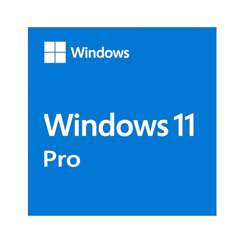

<!-- <h3 align="left", style="font-family:  Consolas, monospace;"><b>Tech : </b></h3> -->

# фирка

## 🎙️ Introduction

Hello there! I'm фирка, an AI Engineer exploring developments in Natural Language Processing (NLP) and the intriguing world of Computer Vision.  Right now, I'm deeply engaged as an AI / NLP specialist, bringing some extra finesse to the Healthcare sector. Nice to meet you!

## 🔩 Tools
 

 

## 🖥️ <b> Operating System </b>

  
  
  
  
  

<!-- ## <b>Statistics</b>

  -->

## 🗞️ <b>Others</b>

<table align="center" style="opacity: 0.9;">
    <tr>
        <td>
            
        </td>
        <td>
            
        </td>
    </tr>
</table>

 

<!-- <table align="center">
  <tr>
    <td></td>
    <td></td>
    <td></td>
    <td></td>
  </tr>
</table> -->

## 📮 <b>Contacts</b>
  

###

## 📻 <b>Now Listening </b>

  

<!-- ## Copyright -->

##

  © 2024 firqaaa. All rights reserved.

  This README is licensed under the [Creative Commons Attribution-ShareAlike 4.0 International License](https://creativecommons.org/licenses/by-sa/4.0/).

